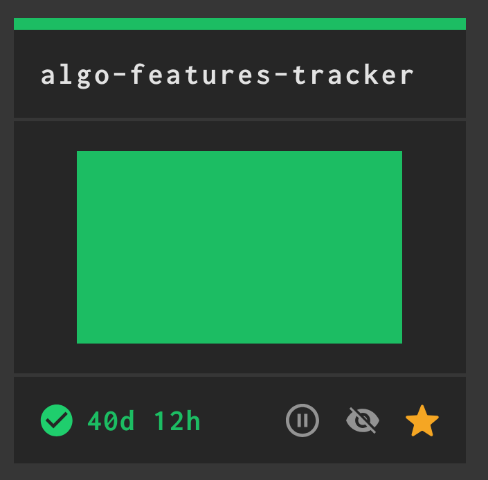
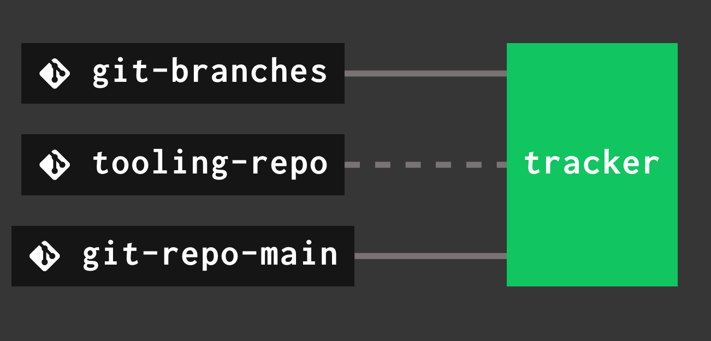
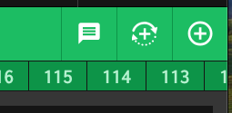
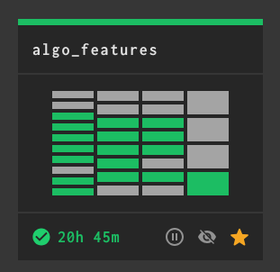
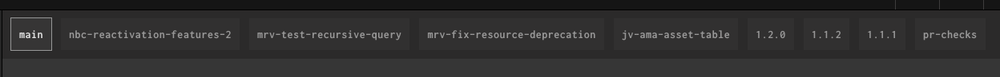
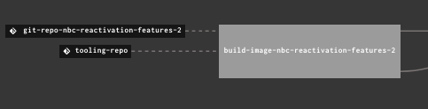
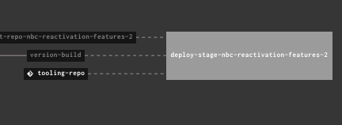

# Deploying a Pipeline to Stage

1. Make a new branch with the prefix `deploy/`
```bash
git checkout -b deploy/<your initials>/<your feature branch>
```

2. Push you branch to the origin
```shell
git push
```

3. Go to the `algo-features-tracker` [pipeline](https://concourse-mgmt.nbcupea.mgmt.nbcuott.com/teams/ds-algo/pipelines/algo-features-tracker)



5. Click on the green box that says `tracker`



6. In the top right corner, click the `+` sign to trigger a new build.



7. After the build runs, your branch should appear as a deployment group in the algo features pipeline. To find it navigate to the `algo_features` [pipeline](https://concourse-mgmt.nbcupea.mgmt.nbcuott.com/teams/ds-algo/pipelines/algo_features)




8. Click on the group at the top that matches the name of your branch. Here we are using `nbc-reactivation-features-2` as an example.



9. Click on the box labeled `build-image-<your feature branch name>`



10. In the top right corner, click the `+` sign to trigger a new build. This box will be gray the first time you run the pipeline and green all subsequent times. This will trigger an image build. After the build completes, the next step in the pipeline (deployment to dev) will run automatically.


11. After the build and deployment to dev have finished, click on the box that says `deploy-stage-<your feature branch name>`



12. In the top right corner, click the `+` sign to trigger a new build. When this build completes, your files have been delivered to the [stage Airflow](https://airflow-algo-int-nft-nbcu-ds-int-nft.nbcupea.stage.nbcuott.com/home). It may take up to 5 minutes for airflow to discover a new DAG. Changes to an existing DAG should be reflected immediately.


